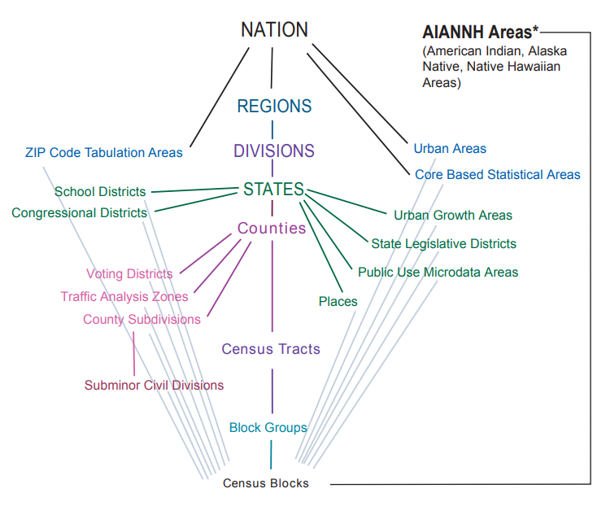
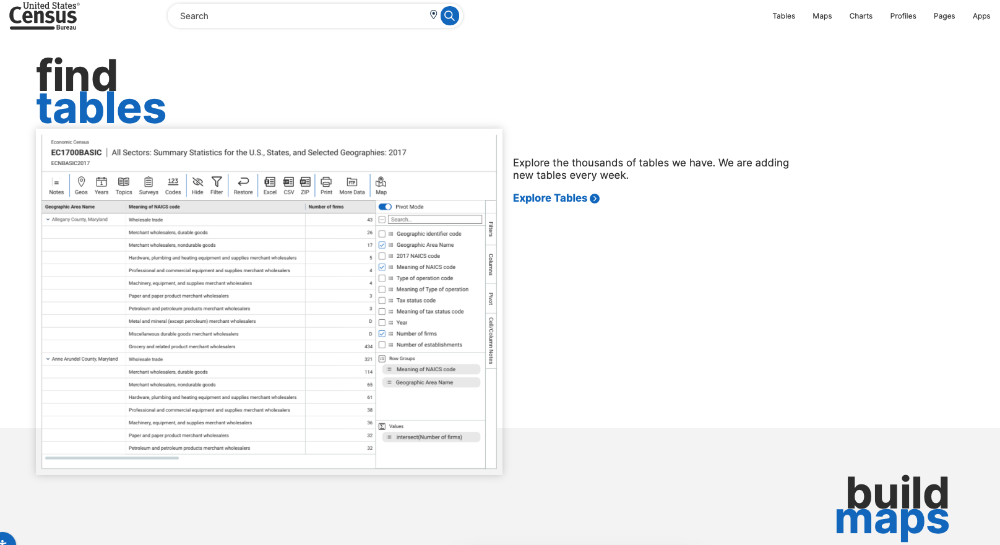

## TL;DR:  Census and American Community Survey Data via `tidycensus`

- Obtain a Census API key: https://api.census.gov/data/key_signup.html
- Core functions in `tidycensus` include: 

    * `get_decennial()`, which requests data from the US Decennial Census APIs for 2000, 2010, and 2020.
    
    * `get_acs()`, which requests data from the 1-year and 5-year American Community Survey samples. Data are available from the 1-year ACS back to 2005 and the 5-year ACS back to 2005-2009.
    
- Retrieve `tidyverse`-ready data format (or traditional wide format if requested).
    
- Explore and visualize data with `ggplot2`.

- See  the book [Analyzing US Census Data: Methods, Maps, and Models in R](https://walker-data.com/census-r/index.html) by  Kyle Walker.

- **Ethics & integrity**: Avoid misleading color scales or changing breakpoints over time. Prefer consistent bins, clear titles, and notes on data sources.

---

```{r setup, include=FALSE}
knitr::opts_chunk$set(echo = TRUE, message = FALSE, warning = FALSE)
```

`tidycensus` is designed to help R users get Census data that is prepared for exploration within the `tidyverse`, and optionally spatially as it automatically downloads and merges Census geometries to data for mapping. 

We will see several of the options available with this package, but you can read more about the `tidycensus` package [here](https://walker-data.com/tidycensus/) and see more examples [here](https://walker-data.com/census-r/). 

<!-- https://walker-data.com -->

## Census hierarchy  and Data Downloads

Aggregate data from the decennial U.S Census, American Community Survey (ACS), and other Census surveys are released for various geographic units called *enumeration units*. These include legal entities like states and counties, as well as statistical areas used for standardized reporting.

This hierarchy is summarized in the graphic below (from https://www.census.gov/programs-surveys/geography/guidance/hierarchy.html).

{ width=80% }


U.S. Census data are available from a variety of sources. For years, researchers would visit the  **US Census Bureau’s American FactFinder** site to download Census data for custom geographies. American FactFinder was decommissioned in 2020, giving way to a new data download interface, (https://data.census.gov).

{width=80%}


\color{blue}{**Another way to download Census data involves using Application Programming Interfaces (APIs).**}

## Census Bureau’s data API

-  **APIs** let users and software access data directly from large databases like the U.S. Census.

-  They provide **programmatic access** to data- meaning you can retrieve information automatically without manually downloading files.

-  **Software packages** (like `tidycensus` in R) simplify API use, so you can get data with just one line of code.

- APIs enable **automation, reproducibility, and scalability** which as you guys are learning in this class are key skills for data analysis and research.

- Access typically requires a **free API key**, which identifies you as a user and manages access limits.


[Get your Census API key](https://api.census.gov/data/key_signup.html)


## Setup

```{r}
#install.packages("tidycensus")
library(tidycensus)
library(tidyverse)


#Set your Census API key with the census_api_key() function (only need to do this once!)

#census_api_key("YOUR_KEY_HERE", install = TRUE) #install=TRUE installs the key for use in future R sessions

#readRenviron("~/.Renviron") #run this to use  API key

#Check API key
#Sys.getenv("CENSUS_API_KEY")

```

## Retrieving data

You can retrieve data using functions `get_decennial()`, which requests data from the US Decennial Census APIs for 2000, 2010, and 2020. And `get_acs()`, which requests data from the 1-year and 5-year American Community Survey samples. Data are available from the 1-year ACS back to 2005 and the 5-year ACS back to 2005-2009.


The structure of these functions is very similar:

```
get_decennial(geography, variables, year, state = NULL, county = NULL, geometry = FALSE, ...)`


get_acs(geography, variables, year, survey = "acs5", state = NULL, county = NULL, geometry = FALSE, summary_var= ...)`
```


They retrieve data from the U.S. Census Bureau’s APIs and return a **tidy tibble** with columns like:

- **GEOID** – unique geographic identifier
- **NAME** – name of the area (e.g., “Cook County, Illinois”)
- **variable** – variable ID (e.g., "B01003_001")
- **estimate** – estimated value for that variable
- **moe** – margin of error (for ACS only)
- **geometry (optional)** – spatial boundaries for mapping


| Argument                  | Description                                                                                                                               |
|---------------------------|-------------------------------------------------------------------------------------------------------------------------------------------|
| **`geography`**           | The geographic level of data (e.g., `"state"`, `"county"`, `"tract"`, `"block group"`).                                                   |
| **`variables`**           | One or more variable IDs to pull (e.g., `"B19013_001"` for median income). You can also use `load_variables()` to look up variable names. |
| **`year`**                | The year of the data. For example, `year = 2022`.                                                                                         |
| **`state`, `county`**     | Optional filters to limit the data to a specific state or county.                                                                         |
| **`geometry`**            | If `TRUE`, returns spatial data (simple features) for mapping. If `FALSE`, returns only a table.                                          |
| **`survey`** *(ACS only)* | Choose between `"acs1"` (1-year) or `"acs5"` (5-year) data. Most small-area data use `"acs5"`.                                            |
| **`output`**              | Can be `"tidy"` (default) or `"wide"`, which changes the data layout.                                                                     |

```{r message=FALSE, warning=FALSE, include=FALSE}

df1<-get_decennial(
  geography = "county",
  variables = "P001001",   # Total population
  year = 2010,
  state = "MA",
  geometry = FALSE
)

df2<-get_acs(
  geography = "tract",
  variables = "B19013_001",  # Median household income
  year = 2022,
  state = "MA",
  geometry = FALSE
)
#if you don't specify output, you'll get a tidy or long format dataframe

df2_wide1<-get_acs(
  geography = "tract",
  variables = "B19013_001",  # Median household income
  year = 2022,
  state = "MA",output = "wide", geometry = TRUE
)
#The argument output = "wide" spreads Census variables across the columns, returning one row per geographic unit and one column per variable

#geometry = TRUE returns a spatial Census dataset containing simple feature(sf) geometries

```


```{r}
head(df1)
head(df2)
head(df2_wide1)
df2 %>% filter(GEOID == "25001010100")
df2_wide1 %>% filter(GEOID == "25001010100")

```


## Searching for variables in `tidycensus`

One additional challenge when searching for Census variables is understanding variable IDs, which are required to fetch data from the Census and ACS APIs. There are thousands of variables available across the different datasets and summary files. To make searching easier for R users, `tidycensus` offers the `load_variables()` function. 


```{r}
v16 <- load_variables(year = 2016, dataset = "acs5") #for more options/ documentation: help(load_variables) 

head(v16)

#View(v16)
```

By browsing the table in this way, you can identify the appropriate variable IDs (found in the name column) that can be passed to the variables parameter in `get_acs()` or `get_decennial()`. 


## Wrangling Census data with tidyverse tools

We can use all the data wrangling functions and tricks that we've learned through this class and now the Census data is an R `data.frame` object. For example,

1. We can reshape the data from long format to wide format using `pivot_wider()`.
2. We can create new variables (i.e., add new columns) using `mutate()`
3. We can subset the data, and look at the distribution of variables via histograms, boxplots, maps, etc...

4.  You can also make journal-style "Table 1" summaries of these data using the `tableone` package you'll learn about in class.
 
 

```{r}

df2_wide2<-df2 %>% select("GEOID","NAME","variable","estimate") %>% 
                                  pivot_wider(id_cols = "GEOID",names_from = variable,values_from = estimate) %>% 
                                  rename(median_income = "B19013_001")

head(df2_wide2)

```

## Visualizations

```{r}

df2_wide2 %>%  ggplot(aes(median_income)) + 
   geom_histogram(fill = "lightblue", colour = "black") +
  labs(title = " Median Household Income by Census Tracts in MA",
       caption = "Data source: 2018-2022 5-year ACS", x = "Median household income ", y = "Count") + theme_minimal()


df2_wide1<-df2_wide1 %>% rename(median_income = "B19013_001E")
df2_wide1 %>% ggplot(aes(fill = median_income)) + 
  geom_sf(color = NA) + 
  coord_sf(crs = 6491, datum = NA) +
  scale_fill_viridis_c(option = "C",direction = 1) +
  labs(title = " Median Household Income by Census Tracts in MA",
       caption = "Data source: 2018-2022 5-year ACS",
       fill = "Estimate") + theme_minimal()


#6491	NAD83(2011) / Massachusetts Mainland Zone meters
# coord_sf(crs = 6491):  Help with projection/CRS
# coords_sf(datum = NA):  Remove gridlines, i.e graticules

##Colors
#https://colorbrewer2.org/#type=sequential&scheme=YlOrRd&n=3
#https://ggplot2.tidyverse.org/reference/scale_viridis.html


```


```{r include=FALSE}
#Overall race/ethnicity breakdown for MA (2015-2019)
racevars<- c(`Non-Hispanic White` = "B03002_003",
             `Non-Hispanic Black` = "B03002_004",
              `Non-Hispanic AIAN` = "B03002_005",
              `Non-Hispanic Asian` = "B03002_006",
              `Non-Hispanic NHPI`="B03002_007",
             `Hispanic/Latino` = "B03002_012")
racedat<-get_acs(state = "MA", geography = "tract", 
                  variables = racevars, year = 2019, geometry = TRUE, 
              summary_var ="B03002_001")

#Here summary_var is usually a variable (e.g. total population) that you'll want to use as a denominator or comparison.


```

```{r}
racedat<-racedat %>% mutate(Percentage = 100 * (estimate / summary_est))
head(racedat)


racedat %>% ggplot(aes(fill = Percentage)) + 
  facet_wrap(~ variable) +
  geom_sf(color = NA) + 
  coord_sf(crs = 6491, datum = NA) +
  scale_fill_viridis_c(option = "C",direction = 1) +
  labs(title = " Race/Ethnicity by Census Tracts in MA",
       caption = "Data source: 2019 5-year ACS",
       fill = "Percent") + theme_minimal()

```

```{r}
#Other demographic variables
vars<-c(`High school graduate or higher` = "DP02_0067P",
                 `Bachelors degree or higher` = "DP02_0068P",
                 `Below Poverty Line` = "DP03_0119P",
                  `Renter Occupied Housing` = "DP04_0047P",
                   `Owner Occupied Housing` = "DP04_0046P")
  
 
demographics_2019<-get_acs(state = "MA", geography = "tract", 
                  variables = vars, year = 2019, geometry = TRUE)

demographics_2019 %>% filter(variable %in% c("High school graduate or higher","Bachelors degree or higher")) %>% ggplot(aes(fill = estimate)) + 
  facet_wrap(~ variable) +                            
  geom_sf(color = NA) + 
  coord_sf(crs = 6491, datum = NA) +
  scale_fill_viridis_c(option = "C",direction = 1) +
  labs(title = "Educational Attainment by Census Tracts in MA",
       caption = "Data source: 2015-2019 5-year ACS",
       fill = "Percentage") + theme_minimal()

demographics_2019 %>% filter(variable==c("Below Poverty Line")) %>% ggplot(aes(fill = estimate)) + 
  geom_sf(color = NA) + 
  coord_sf(crs = 6491, datum = NA) +
  scale_fill_viridis_c(option = "C",direction = 1) +
  labs(title = "Families and people whose income is below poverty level by Census Tracts in MA",
       caption = "Data source: 2015-2019 5-year ACS",
       fill = "Percentage") + theme_minimal()

demographics_2019 %>% filter(variable %in% c("Renter Occupied Housing","Owner Occupied Housing")) %>% 
  ggplot(aes(fill = estimate)) +  
  facet_wrap(~ variable) +
  geom_sf(color = NA) + 
  coord_sf(crs = 6491, datum = NA) +
  scale_fill_viridis_c(option = "C",direction = 1) +
  labs(title = "Housing tenure by Census Tracts in MA",
       caption = "Data source: 2015-2019 5-year ACS",
       fill = "Percentage") + theme_minimal()

```


## Limitations of using these data

- Aggregate (percentages, median values, ratios, counts) at geographical levels, and household level (ACS, e.g., "total population" is really "total population in households.)

- Data are zero-inflated (some data might be suppressed due to small units like census tracts)

- Missing data due to household non-response or data suppression.

- Data are essentially point estimates for year intervals (e.g., 5-year estimates from ACS), and ACS provides marginal error estimates. 

- Ecological studies 


