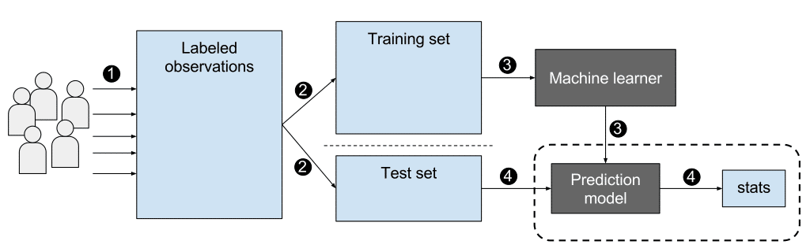

```{r, echo=FALSE, message=FALSE, warning=FALSE}
options(digits=3)
set.seed(1)
library(tidyverse)
library(dslabs)
ds_theme_set()
```

# Introduction

Perhaps the most popular data science methodologies come from the field of _machine learning_. Machine learning success stories include the handwritten zip code readers implemented by the postal service, speech recognition technology such as Apple's Siri, movie recommendation systems, spam and malware detectors, housing price predictors, and driverless cars. Although today Artificial Intelligence and machine learning are often used interchangeably, we make the following distinction: while the first artificial intelligence algorithms, such as those used by chess playing machines, implemented decision making based on programmable rules derived from theory or first principles, in machine learning decisions are based on algorithms **built with data**. 


## Notation

In machine learning, data comes in the form of:

1. the _outcome_ we want to predict and 
2. the _features_ that we will use to predict the outcome

We want to build an algorithm that takes feature values as input and returns a prediction for the outcome when we don't know the outcome. The machine learning approach is to _train_ an algorithm using a dataset for which we do know the outcome, and then apply this algorithm in the future to make a prediction when we don't know the outcome.

Here we will use $Y$ to denote the outcome and $X_1, \dots, X_p$ to denote features. Note that features are sometimes referred to as predictors or covariates. We consider all these to be synonyms.

Prediction problems can be divided into categorical and continuous outcomes. For categorical outcomes, $Y$ can be any one of $K$ classes. The number of classes can vary greatly across applications.
For example, in the digit reader data, $K=10$ with the classes being the digits 0, 1, 2, 3, 4, 5, 6, 7, 8, and 9. In speech recognition, the outcomes are all possible words or phrases we are trying to detect. Spam detection has two outcomes: spam or not spam. In this course, we denote the $K$ categories with indexes $k=1,\dots,K$. However, for binary data we will use $k=0,1$ for mathematical conveniences that we demonstrate later.

The general setup is as follows. We have a series of features and an unknown outcome we want to predict:

```{r, echo=FALSE, message=FALSE, warning=FALSE}
library(tidyverse)
library(knitr)
library(dslabs)
tmp <- tibble(outcome="?", 
              'feature 1' = "$X_1$",
              'feature 2' = "$X_2$",
              'feature 3' = "$X_3$",
              'feature 4' = "$X_4$",
              'feature 5' = "$X_5$")
if(knitr::is_html_output()){
  knitr::kable(tmp, "html", align = "c") %>%
    kableExtra::kable_styling(bootstrap_options = "striped", full_width = FALSE)
} else{
  knitr::kable(tmp, "latex", align="c", escape = FALSE, booktabs = TRUE) %>%
    kableExtra::kable_styling(font_size = 8)
}
```

To _build a model_ that provides a prediction for any set of observed values $X_1=x_1, X_2=x_2, \dots X_5=x_5$, we collect data for which we know the outcome:

```{r, echo=FALSE}
n <- 2
tmp <- tibble(outcome = paste0("$y_{", 1:n,"}$"), 
              'feature 1' = paste0("$x_{",1:n,",1}$"),
              'feature 2' = paste0("$x_{",1:n,",2}$"),
              'feature 3' = paste0("$x_{",1:n,",3}$"),
              'feature 4' = paste0("$x_{",1:n,",4}$"),
              'feature 5' = paste0("$x_{",1:n,",5}$"))
tmp_2 <- rbind(c("$\\vdots$", "$\\vdots$", "$\\vdots$", "$\\vdots$", "$\\vdots$", "$\\vdots$"),
               c("$y_n$", "$x_{n,1}$","$x_{n,2}$","$x_{n,3}$","$x_{n,4}$","$x_{n,5}$"))
colnames(tmp_2) <- names(tmp)
tmp <- bind_rows(tmp, as_tibble(tmp_2))
if(knitr::is_html_output()){
  knitr::kable(tmp, "html") %>%
    kableExtra::kable_styling(bootstrap_options = "striped", full_width = FALSE)
} else{
  knitr::kable(tmp, "latex", escape = FALSE, booktabs = TRUE) %>%
    kableExtra::kable_styling(font_size = 8)
}
```

When the output is continuous we refer to the machine learning task as _prediction_, and the main output of the model is a function $f$ that automatically produces a prediction, denoted with $\hat{y}$, for any set of predictors: $\hat{y} = f(x_1, x_2, \dots, x_p)$.  We use the term _actual outcome_ to denote what we ended up observing. So we want the prediction $\hat{y}$ to match the actual outcome $y$ as well as possible. Because our outcome is continuous, our predictions $\hat{y}$ will not be either exactly right or wrong, but instead we will determine an _error_ defined as the difference between the prediction and the actual outcome $y - \hat{y}$.

When the outcome is categorical, we refer to the machine learning task as _classification_, and the main output of the model will be a _decision rule_ which prescribes which of the $K$ classes we should predict. In this scenario, most models provide functions of the predictors for each class $k$, $f_k(x_1, x_2, \dots, x_p)$, that are used to make this decision. When the data is binary a typical decision rules looks like this: if $f_1(x_1, x_2, \dots, x_p) > C$, predict category 1, if not the other category, with $C$ a predetermined cutoff. Because the outcomes are categorical, our predictions will be either right or wrong. 

Notice that these terms vary among courses, text books, and other publications. Often _prediction_ is used for both categorical and continuous outcomes, and the term _regression_ can be used for the continuous case. Here we avoid using _regression_ to avoid confusion with our previous use of the term _linear regression_. In most cases it will be clear if our outcomes are categorical or continuous, so we will avoid using these terms when possible. 





# Case Study 1: Digit reader 

Let's consider an example. The first thing that happens to a letter when they are received in the post office is that they are sorted by zip code:

```{r, echo=FALSE}
knitr::include_graphics("https://d79i1fxsrar4t.cloudfront.net/assets/img/docs/zip-code-digits.47d1a727.png")
```

Originally humans had to sort these by hand. To do this they had to read the zip codes on each letter. Today thanks to machine learning algorithms, a computer can read zip codes and then a robot sorts the letters. In this lecture we will learn how to build algorithms that can read a digit.

The first step in building an algorithm is to understand what the outcomes and features are. Below are three images of written digits. These have already been read by a human and assigned an outcome $y$. These are considered known and serve as the **training set**. 

```{r, echo=FALSE, cache=TRUE, message=FALSE}
url <- "https://raw.githubusercontent.com/datasciencelabs/data/master/hand-written-digits-train.csv"
digits <- read_csv(url)
tmp <- lapply( c(1,4,5), function(i){
    expand.grid(Row=1:28, Column=1:28) %>%  
      mutate(id=i, label=digits$label[i],  
             value = unlist(digits[i,-1])) 
})
tmp <- Reduce(rbind, tmp)
tmp %>% ggplot(aes(Row, Column, fill=value)) + 
    geom_raster() + 
    scale_y_reverse() +
    scale_fill_gradient(low="white", high="black") +
    facet_grid(.~label)
```

The images are converted into $28 \times 28 = 784$ pixels and for each pixel we obtain a grey scale intensity between 0 (white) and 255 (black) which we consider continuous for now. We can see these values like this:

```{r, echo=FALSE}
tmp %>% ggplot(aes(Row, Column, fill=value)) + 
    geom_point(pch=21) + 
    scale_y_reverse() +
    scale_fill_gradient(low="white", high="black") +
    facet_grid(.~label)
```

For each digit $i$ we have a categorical outcome $Y_i$ which can be one of 10 values: $0,1,2,3,4,5,6,7,8,9$ and features $X_{i,1}, \dots, X_{i,784}$. We use bold face $\mathbf{X}_i = (X_{i,1}, \dots, X_{i,784})$ to distinguish the vector from the individual predictors. When referring to an arbitrary set of features we drop the index $i$ and use $Y$ and $\mathbf{X} = (X_{1}, \dots, X_{784})$. We use upper case variables because, in general, we think of the predictors as random variables. We use lower case, for example $\mathbf{X} = \mathbf{x}$, to denote observed values. 

The machine learning task is to build an algorithm that returns a prediction for any of the possible values of the features. Here we will learn several approaches to building these algorithms. Although at this point it might seem impossible to achieve this, we will start with a simpler example, and build up our knowledge until we can attack this more complex example.


# Case Study 2: Melanoma

In this case study, we will walk through a complete binary classification workflow using the `melanoma` dataset from the `boot` package. The dataset contains information on tumor characteristics and survival outcomes for 205 patients diagnosed with malignant melanoma.

Our goal is to predict whether a patient died from melanoma, using only the tumor thickness as a predictor. This gives us a simple but instructive classification problem, allowing us to compare different modeling strategies:
* Logistic Regression
* Naïve Bayes
* Models evaluated with k-fold cross-validation
* k-Nearest Neighbors

This case study mirrors a realistic medical prediction scenario:

*Given a new patient with a tumor of a certain thickness, what is the probability that they will die from melanoma?*

To simplify the problem and focus on the classification task itself we will focus only on patients who either died from melanoma (`1`) or were still alive at the end of the study (`2`), and drop anyone who died of other causes. 

Key variables:

* `time`: survival time in days
* `status`: event indicator  
  - 1 = died from melanoma  
  - 2 = alive at end of study
  - 3 = died from other causes
* `age`: age in years at time of operation
* `sex`: 0 = female, 1 = male
* `year`: year of operation
* `thickness`: tumor thickness (mm)
* `ulcer`: 0 = no ulceration, 1 = ulceration present

Before fitting any models, we will preprocess the dataset to:

1. Keep only the two relevant outcomes (died from melanoma vs. alive)
2. Convert the outcome into a human-readable factor (Dead, Alive)
3. Create a binary numerical outcome (y) for modeling

```{r, message=FALSE}
library(tidyverse)
library(boot)
data(melanoma)

melanoma <- melanoma %>% 
  filter(status %in% c(1, 2)) %>% 
  mutate(status = as.factor(ifelse(status == 1, "Dead", "Alive")),
         y = as.factor(ifelse(status == "Dead", 1, 0)))
```

```{r}
head(melanoma)
```

Let's check class balance. This step is essential because imbalanced classes can strongly influence how we interpret accuracy, ROC curves, and model performance.

```{r}
table(melanoma$status)
```

We can see that there is class imbalance: most patients (70.2%) did not die during the study period. We will take this into account when splitting our data into training and test sets.

```{r}
melanoma %>%
  ggplot(aes(status, thickness)) +
  geom_boxplot(color = "darkred") +
  xlab("") +
  ylab("Tumor thickness (mm)")
```


Let's split our data into training and test sets. We'll use `set.seed` to ensure our training and test sets are the same every time we run the code. Because of the class imbalance, we use stratified sampling so that both sets have a similar proportion of Dead/Alive outcomes. This is done using the `stratified` function from the `splitstackshape` package.


```{r, message=FALSE}
library(splitstackshape)
set.seed(10)

x           <- stratified(melanoma, "y", 0.7, keep.rownames = TRUE)
train_set   <- x %>% dplyr::select(-rn)
train_index <- as.numeric(x$rn)
test_set    <- melanoma[-train_index,]
```

Check that the split looks correct:

```{r}
dim(train_set)
head(train_set)
dim(test_set)
head(test_set)
```

## Logistic regression

Logistic regression is a parametric, interpretable model widely used in clinical research. Here, it models the log-odds of death as a function of tumor thickness. We use the `glm` function and specify the model (`y ~ thickness`), the data to use (`train_set`) and `family = "binomial"` to indicate we want a logistic regression model (there are several models available and we have to be specific). 

```{r}
fit_logit <- glm(y ~ thickness,
                data = train_set, 
                family = "binomial")
```

Logistic regression outputs estimated probabilities of death (`p-hat`), which we need to convert to 0s and 1s (`y_hat`) based on a threshold. We will use 0.5 as the threshold. 

```{r}
p_hat_logit <- predict(fit_logit, 
                      newdata = test_set, 
                      type = "response")

head(p_hat_logit)

y_hat_logit <- ifelse(p_hat_logit >= 0.5, "Dead", "Alive")

head(y_hat_logit)
```

We can now evaluate classification performance by producing the confusion matrix. The confusion matrix gives insight into sensitivity (recall for `Dead` class), specificity, overall accuracy, F1 score, which is especially useful when classes are uneven or misclassification costs differ, etc.

```{r, message=FALSE}
library(caret)
cm_logit <- confusionMatrix(data = as.factor(y_hat_logit), 
                reference = test_set$status, positive = "Dead")
cm_logit
cm_logit$byClass["F1"]
```

ROC curves provide a threshold-independent view of model performance. We can first calculate the sensitivity and specificity for different thresholds using the `roc` function from the `pROC` package.

```{r, message=FALSE}
library(pROC)
roc_logit <- roc(test_set$y, p_hat_logit)
```

We can then plot the ROC curve using `ggroc`. Here, `list` is a way to label each curve in the plot in a readable way.

```{r}
ggroc(list("Logistic regression" = roc_logit)) +
  theme(legend.title = element_blank()) +
  geom_segment(aes(x = 1, xend = 0, y = 0, yend = 1), 
               color = "black", 
               linetype = "dashed") +
  ylab("Sensitivity") +
  xlab("Specificity") 
```

AUROC (AUC) is often preferred over accuracy in medical settings because it is insensitive to class imbalance and reflects how well the model ranks patients by risk. To calculate the AUROC, we can use the `auc` function. 

```{r}
auc(roc_logit)
```


## Naive Bayes

Naïve Bayes is a probabilistic classifier that assumes predictors are conditionally independent within each class. Although this assumption is rarely exactly true in practice, Naïve Bayes often performs well, especially for simple or high-dimensional datasets.

We will use the `naiveBayes` function from the `e1071` package to train the model. The rest of the workflow is exactly what we did when we trained the logistic regression model. 

```{r, message=FALSE}
library(e1071)

fit_nb   <- naiveBayes(y ~ thickness, data = train_set)

p_hat_nb <- predict(fit_nb, test_set, type = "raw")[,2]
head(p_hat_nb)

y_hat_nb <- ifelse(p_hat_nb >= 0.5, "Dead", "Alive")
head(y_hat_nb)

cm_nb <- confusionMatrix(data = as.factor(y_hat_nb), 
                      reference = test_set$status, positive = "Dead")
cm_nb
cm_nb$byClass["F1"]
```

We can add the Naive Bayes ROC curve to the plot to compare the models. 

```{r, message=FALSE}
roc_nb <- roc(test_set$y, p_hat_nb)

ggroc(list("Logistic regression" = roc_logit,
           "Naive Bayes" = roc_nb)) +
  theme(legend.title = element_blank()) +
  geom_segment(aes(x = 1, xend = 0, y = 0, yend = 1), 
               color = "black", 
               linetype = "dashed") +
  ylab("Sensitivity") +
  xlab("Specificity") 

auc(roc_nb)
```

The logistic regression model is performing better in terms of AUROC. 

## k-fold cross validation (CV)

Cross-validation helps us assess how well a model will generalize and allows us to evaluate performance using metrics beyond accuracy, including AUC.

Here we re-code the outcome for caret:

```{r}
melanoma <- melanoma %>% 
  filter(status %in% c(1, 2)) %>% 
  mutate(status = as.factor(ifelse(status == 1, "Dead", "Alive")),
         status = factor(status,
                    levels = c("Alive", "Dead"),
                    labels = c("Negative", "Positive")),
         y = as.factor(ifelse(status == "Dead", 1, 0)))
```

For 10-fold cross-validation specify:

* Probability estimates returned (`classProbs = TRUE`)
* ROC/AUC as the optimization metric (`summaryFunction = twoClassSummary`)
* k-fold CV (`method = "cv"`, `number = 10`)
	
```{r}
set.seed(123)

cv10 <- trainControl(
  method = "cv",
  number = 10,
  classProbs = TRUE,
  summaryFunction = twoClassSummary
)
```

Logistic Regression with CV. Here, caret selects the model with the highest cross-validated AUC.

```{r}
log_cv <- train(
  status ~ thickness,
  data = train_set,
  method = "glm",
  family = binomial,
  trControl = cv10,
  metric = "ROC"
)

log_cv
```


Naive Bayes with CV. Here, caret selects the model with the highest cross-validated AUC.

```{r, message=FALSE}
library(naivebayes)

nb_cv <- train(
  status ~ thickness,
  data = train_set,
  method = "naive_bayes",
  trControl = cv10,
  metric = "ROC"
)

nb_cv
```

```{r}
p_hat_logit_cv <- predict(log_cv, test_set, type = "prob")[,2]

y_hat_logit_cv <- factor(ifelse(p_hat_logit_cv >= 0.5, "Dead", "Alive"),
                      levels=c("Alive","Dead"))

cm_logit <- confusionMatrix(y_hat_logit_cv, test_set$status, positive = "Dead")
cm_logit
cm_logit$byClass["F1"]
```

```{r}
p_hat_nb_cv    <- predict(nb_cv, test_set, type = "prob")[,2]

y_hat_nb_cv  <- factor(ifelse(p_hat_nb_cv >= 0.5, "Dead", "Alive"),
                      levels=c("Alive","Dead"))

cm_nb <- confusionMatrix(y_hat_nb_cv,  test_set$status, positive = "Dead")
cm_nb
cm_nb$byClass["F1"]
```

```{r, message=FALSE}
roc_logit_cv <- roc(test_set$y, p_hat_logit_cv)
roc_nb_cv <- roc(test_set$y, p_hat_nb_cv)

ggroc(list("Logistic regression" = roc_logit_cv,
           "Naive Bayes" = roc_nb_cv)) +
  theme(legend.title = element_blank()) +
  geom_segment(aes(x = 1, xend = 0, y = 0, yend = 1), 
               color = "black", 
               linetype = "dashed") +
  ylab("Sensitivity") +
  xlab("Specificity") 

auc(roc_logit_cv)
auc(roc_nb_cv)
```


## k-Nearest Neighbors (KNN)

We will now introduce the **k-nearest neighbors (KNN)** algorithm for classification and demonstrate how to use cross-validation to choose the tuning parameter **k**. We will again use the `melanoma` dataset from the `boot` package as a real-world example.

The **k-Nearest Neighbors (KNN)** algorithm is a simple, non-parametric method for classification and regression based on distance. Distance is usually [Euclidean distance](https://en.wikipedia.org/wiki/Euclidean_distance) or the [Manhattan distance](https://en.wikipedia.org/wiki/Taxicab_geometry). 

Here are the steps for classification:

1. To predict the class of a new observation, we compute the **distance** between the new point and every observation in the training set.
2. We find the **k closest** (nearest) observations according to this distance.
3. We assign the new point the **majority class** among those neighbors.

Important points about KNN:

* KNN does not learn an explicit model with parameters, unlike logistic regression and Naive Bayes
* Predictions are based on local neighborhoods in the **feature space** (predictor space).
* The choice of distance metric (commonly Euclidean) and the scale of features matter a lot - small changes can result in large differences in predictions and prediction accuracy
* The tuning parameter **k** controls the flexibility:  
  - Small k = more flexible, higher variance, more sensitive to noise, usually les bias
  - Large k = smoother decision boundary, higher bias

Because KNN relies on distances, features with larger numerical ranges can dominate the distance calculation. Therefore, **standardizing** continuous predictors (e.g., centering and scaling) is crucial.


### Cross-validation setup

We will again use the `caret` package to implement KNN with cross-validation. We'll use 10-fold cross-validation (`number = 10`) just as we did with logistic regression and Naive Bayes. The same `trainControl` function is written below but in practice you would only need to define it once. 

```{r cv-control}
set.seed(123)

cv10 <- trainControl(
  method = "cv",
  number = 10,
  classProbs = TRUE,
  summaryFunction = twoClassSummary
)

```

### Fitting KNN with cross-validation

We define a grid of **k** values to try, for example from 3 to 25 by steps of 2. The `train()` function will fit models for each candidate value of *k*. We will also instruct `caret` to **center and scale** (standardize) our predictors. Here we are only using thickness. We then call `train()` with:

* `method = "knn"` for KNN
* `trControl = cv10` to specify our cross-validation
* `preProcess = c("center", "scale")` so that KNN uses standardized predictors
* `tuneGrid` to define which k values to try
* `metric = "ROC"` to save sensitivity, specificity, and AUROC for each value of k

```{r}
k_grid <- data.frame(k = seq(3, 25, by = 2))

knn_cv <- train(
  status ~ thickness,
  data = train_set,
  method = "knn",
  trControl = cv10,
  preProcess = c("center", "scale"),
  tuneGrid = k_grid,
  metric = "ROC"
)

knn_cv
```

The printed output shows the cross-validated performance (AUROC) for each value of **k**, as well as the **best** k chosen by `caret` (here, k = 19). We can visualize the relationship between **k** and accuracy:

```{r plot-knn}
plot(knn_cv)
```


Once we choose the best value of **k** based on cross-validation, we can evaluate the model on the held-out test data.

```{r predict-knn}
# Predictions on the test set
p_hat_knn_cv <- predict(knn_cv, newdata = test_set, type = "prob")[,2]

# Converting probabilities to 0 or 1
y_hat_knn_cv  <- factor(ifelse(p_hat_knn_cv >= 0.5, "Dead", "Alive"),
                        levels = c("Alive","Dead"))

# Confusion matrix
cm_knn <- confusionMatrix(y_hat_knn_cv, test_set$status, positive = "Dead")
cm_knn
cm_knn$byClass["F1"]
```

## Comparing models

Let's compare this model to the models we trained using logistic regression and Naive Bayes. We will calculate the AUC and plot the ROC curves. 

```{r, message=FALSE}
roc_logit_cv <- roc(test_set$y, p_hat_logit_cv)
roc_nb_cv    <- roc(test_set$y, p_hat_nb_cv)
roc_knn_cv   <- roc(test_set$y, p_hat_knn_cv)

ggroc(list("Logistic regression" = roc_logit_cv,
           "Naive Bayes" = roc_nb_cv,
           "KNN" = roc_knn_cv)) +
  theme(legend.title = element_blank()) +
  geom_segment(aes(x = 1, xend = 0, y = 0, yend = 1), 
               color = "black", 
               linetype = "dashed") +
  ylab("Sensitivity") +
  xlab("Specificity") 

auc(roc_logit_cv)
auc(roc_nb_cv)
auc(roc_knn_cv)
```

The AUC values are all very close with KNN in the lead. 


