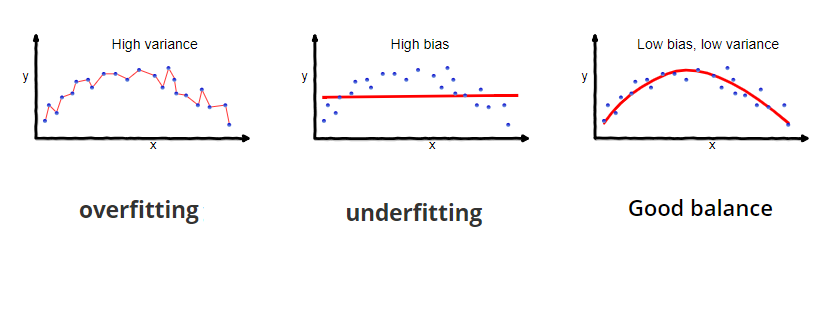
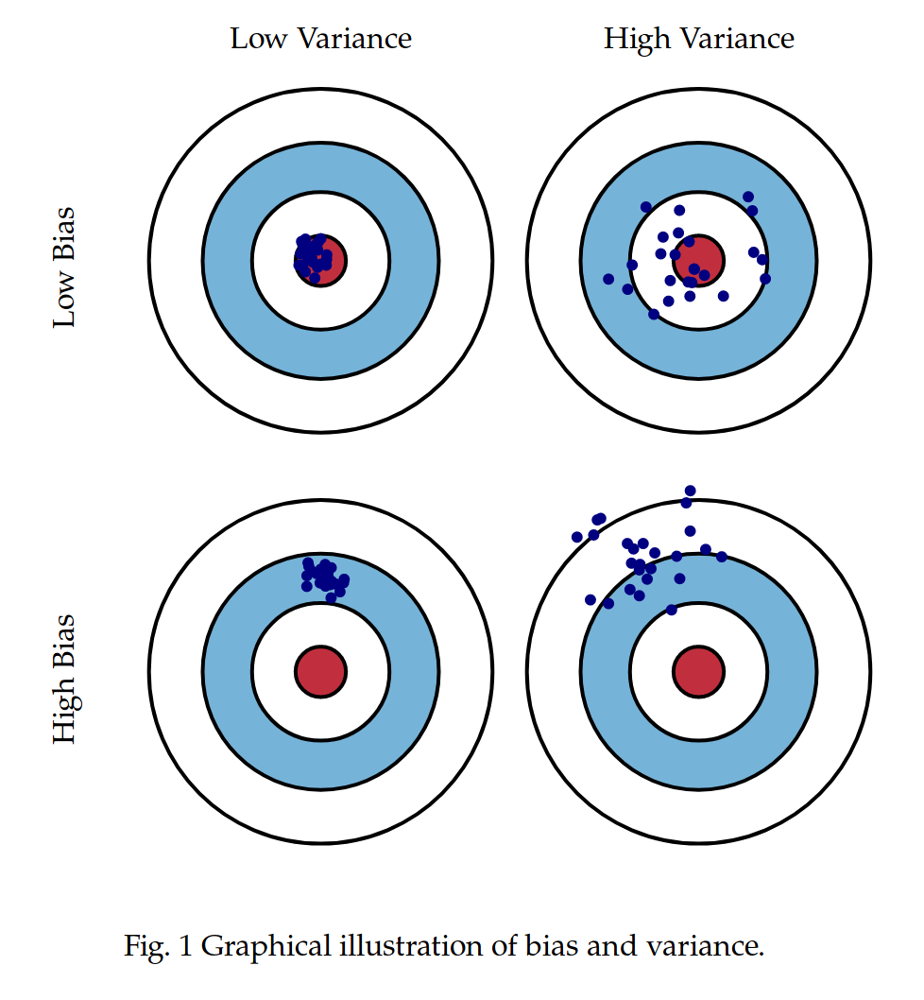

```{r, message=FALSE, warning=FALSE, echo=FALSE}
library(tidyverse)
library(caret)
library(glmnet)
library(GGally)
library(dslabs)
library(dplyr)
ds_theme_set()
```

## Bias-Variance Tradeoff 
The prediction error for any machine learning model can be decomposed into 3 components: **bias**, **variance**, and **irreducible error**. 

> Total error = Variance + Bias squared + Irreducible Error

In mathematical terms:

$$
\mbox{E}[y_0 - \hat f(x_0)]^2 = Var(\hat f(x_0)) + [Bias(\hat f(x_0))]^2 + Var(\epsilon).
$$

Irreducible error is a measure for the noise in our data and can't be reduced by a better model - no matter how good we make our model, our data will have a certain amount of noise or error that cannot be removed. We can, however, create a model with low bias and variance. These quantities are not independent, and decreasing one will increase the other - this is where the term "bias-variance tradeoff" comes from; we want to build a model with the least amount of bias and variance, keeping in mind that we need to find a balance point for these two values.

But what exactly are bias and variance?

* `Bias`: the error that is introduced by approximating a real-life problem, which may be extremely complicated, by a much simpler model. For example, linear regression assumes that there is a linear relationship between $Y$ and $X_1, X_2,...,X_p$. It is unlikely that any real-life problem truly has such a simple linear relationship, and so performing linear regression will undoubtedly result in some bias in the estimate of $f$ (our machine learning model). In other words, building a model that is too simple for the task at hand will result in high bias, whereas a more flexible (complex) model will decrease bias. 

* `Variance`: the amount by which $\hat f$ would change if we estimated it using a different training data set. Since the training data are used to fit the machine learning method, different training data sets will result in a different $\hat f$. But ideally the estimate for $f$ should not vary too much between training sets. However, if a method has high variance then small changes in the training data can result in large changes in $\hat f$. In
general, more flexible statistical methods have higher variance.





<div style="text-align:center"></div>

As a general rule, as we use more flexible methods, the variance will increase and the bias will decrease. As we increase the flexibility of a class of methods, the bias tends to initially decrease faster than the variance increases. Consequently, the expected test set error declines. However, at some point increasing flexibility has little impact on the bias but starts to significantly increase the variance.

Good test set performance of a statistical learning method requires low variance as well as low squared bias. This is referred to as a trade-off because it is easy to obtain a method with extremely low bias but high variance (for instance, by drawing a curve that passes through every single training observation) or a method with very low variance but high bias (by fitting a horizontal line to the data that does not follow a linear pattern). The challenge lies in finding a method for which both the variance and the squared bias are low.

## Regularization
In the regression setting, the standard linear model $Y = \beta_0 + \beta_1X_1 + ... + \beta_pX_p$ is commonly used to describe the relationship between a response $Y$ and a set of variables $X_1, X_2,...,X_p$. We typically fit this model using ordinary least squares (OLS).

However, many machine learning datasets have many predictors ($X_j$s), some of which may not be predictive of the outcome and therefore contributing to increased variance. In this section we will explore common types of **regularization** techniques - shrinkage and dimension reduction - in an effort to increase model performance and interpretability, and decrease variance. For more details on the bias-variance trandoff and regularization methods, see chapters 2 and 6 in [Introduction to Statistical Learning](https://www.statlearning.com/). 


## Shrinkage 

One popular regularization technique is to *shrink* your coefficient estimates toward zero, thereby reducing variance. Examples of shrinkage methods include *ridge regression* and *lasso*. We will discuss these approaches in terms of regression (i.e., the response variable is continuous), but they generally extend to classification problems, similar to the way linear regression extends to logistic regression and other generalized linear models. 

### Ridge regression

If we have $n$ observations and want to predict a response variable $Y$ using linear regression on $p$ covariates $X_1, X_2,...,X_p$, we are trying to find the coefficients $\beta_0, \beta_1, \beta_2, ..., \beta_p$ ($\beta_0$ is the intercept) that minimize the residual sum of squares (RSS): 

$$
\text{RSS} = \sum_{i=1}^n \left( y_i - \beta_0 - \sum_{j=1}^p \beta_j x_{ij} \right)^2
$$

You may remember this setup if you learned about least squares for linear regression. Ridge regression considers minimizing the RSS (the left term below), plus an additional shrinkage penalty, $\lambda \sum_{j=1}^p \beta_j^2$ (the right term below): 

$$
\sum_{i=1}^n \left( y_i - \beta_0 - \sum_{j=1}^p \beta_j x_{ij} \right)^2 + \lambda \sum_{j=1}^p \beta_j^2
$$

This criterion tells us that ridge regression is simultaneously trying to find coefficient estimates that fit the data well (by minimizing the RSS) while also shrinking the coefficients toward zero (by minimizing the shrinkage penalty $\lambda \sum_{j=1}^p \beta_j^2$, which is small when the coefficients are small). Note that the intercept is (usually) not included in the shrinkage penalty. $\lambda \geq 0$ is a *tuning parameter* that controls the relative impact of the two terms. 

When $\lambda = 0$, $\lambda \sum_{j=1}^p \beta_j^2 = 0$ and we are left with just minimizing the RSS, which brings us back to the usual least squares estimates. In this scenario, the coefficient estimates are unbiased but have high variance. As $\lambda$ increases, the shrinkage penalty becomes more influential, and more of the coefficient estimates will approach zero. Ridge regression will become less flexible, which reduces variance but leading to more bias. This is an example of the bias-variance trade-off. Ridge regression and other shrinkage approaches work best when introducing a small amount of bias leads to a substantial reduction in variance. The choice of $\lambda$ is therefore very important, and is typically made using a technique called *cross-validation* (more on this later). 

### Lasso

The lasso is very similar to ridge regression in that we want to minimize both the RSS and a shrinkage penalty. However, this time, the shrinkage penalty is $\lambda \sum_{j=1}^p |\beta_j|$: 

$$
\sum_{i=1}^n \left( y_i - \beta_0 - \sum_{j=1}^p \beta_j x_{ij} \right)^2 + \lambda \sum_{j=1}^p |\beta_j|
$$

So instead of summing over the squares of the $\beta_j$s (the $L_2$ norm) in the shrinkage penalty term, lasso sums over their absolute values (the $L_1$ norm). For this reason, the lasso penalty is sometimes called the $L_1$ penalty, and the ridge regression penalty is sometimes called the $L_2$ penalty. 

Like ridge regression, lasso shrinks coefficient estimates toward zero, but tends to force many of the coefficients to be *exactly* zero. As $\lambda$ increases, more and more of the coefficients will be exactly zero, so unlike ridge regression, lasso performs variable selection! Because lasso models for a given problem tend to have fewer predictors, they are sometimes called *sparse models* and are often easier to interpret than ridge regression models. Again, $\lambda$ should be chosen carefully to balance gains in reducing variance with the introduction of more bias. 

We generally expect lasso to outperform ridge regression when the true coefficients for most of the predictors are zero or close to zero. We expect ridge to do better in scenarios where the response is a function of many predictors, all with coefficients of roughly equal size. 


## $K$-fold cross-validation

As we have seen, cross-validation (CV) is a simple but powerful machine learning technique. We present it here in the context of finding the best value of $\lambda$ for ridge regression and lasso, but it can also be used for selecting other model tuning parameters or assessing model performance. $K$-fold cross validation proceeds as follows: 

1. Choose a grid of $\lambda$ values that you would like to try. 
2. Randomly split your dataset into $K$ non-overlapping groups or *folds*. Popular choices for $K$ are 10, 5 or even the number of observations $n$. 
3. For each of the $K$ folds: 
   a. Take the fold as the holdout or validation set. 
   b. Take the remaining $K$-1 folds as the training set. 
   c. Fit your model (lasso or ridge) on the training set for each value of $\lambda$, 
   d. Evaluate each of your models (trained with different values of $\lambda$) on the validation set, and calculate some performance measure, typically called the cross-validation error or loss. This can be anything that tells you how well your model is predicting your test set responses. 
4. Take the mean of the cross-validation errors across all $K$ folds for each value of $\lambda$. The best tuning parameter is the one with the smallest mean CV error. 
 

## MEPS hospitalization data

The Medical Expenditure Panel Survey (MEPS), conducted by the Agency for Healthcare Research and Quality, contains longitudinal information on participants’ socio-demographics, health behaviors, existing conditions, access to care, health care utilization, and expenditures. Here, we will consider the goal of predicting 2017 hospitalization rates based on data collected about the same individuals in 2016, including age, sex, race, marital status, family income, education, type of insurance coverage, prior diagnosis with angina, arthritis, asthma, cancer, coronary heart disease, diabetes, emphysema, heart attack, high cholesterol, high blood pressure, heart disease, other heart disease, or stroke, perceived general and mental health status, and any hospitalization in 2016. 

The data loaded below is a subset of 1000 individuals from the MEPS 2016–2017 panel data who were aged 18 years or older in 2016. This example is loosely adapted from *Statistics for Health Data Science: An Organic Approach*, by Ruth Etzioni, Micha Mandel, and Roman Gulati (2020), For more information about MEPS and to pull the entire original database, please go [here](https://roman-gulati.github.io/statistics-for-health-data-science/). 

```{r}
# Read in subset of MEPS data
load("meps.rData")

meps %>% dplyr::select(Age, Diabetes.diagnosis, Perceived.health, Anyhosp2016, Anyhosp2017) %>% head
```

There is a category (level) defined to be part of the `Married` variable that does not show up in the dataset because none of the respondents chose the category ("Inapplicable"). This doesn't affect the model performance in any way, but it does change the code that calculates how many predictors were shrunk to 0 for each model. For ridge regression, none of the predictors are pushed exactly to 0, but if we do not remove the "Inapplicable" level from the dataset, the calculation will say that 2.27% of predictors are equal to 0, meaning 1 predictor, the indicator variable for the "Inapplicable" level. Below, to make sure the calculation is correct, we drop any levels that are defined for a predictor, but don't show up anywhere in the dataset. We do this using the `droplevels` function, and then check that it worked by printing the levels of the `Married` variable.

```{r}
levels(meps$Married)

meps <- droplevels(meps)

levels(meps$Married)
```


Now we are ready to train the models.

The `glmnet` function from the `glmnet` package fits ridge and lasso for both regression and classification problems. However, the `glmnet` function expects you to pass in the predictors as a numeric model matrix: it can't handle categorical variables coded as factors. The `model.matrix` function creates the appropriate model matrix by converting factors into indicator variables (dummy variables) as necessary. In the code below, `~ .-1` tells `model.matrix` to include all predictors except the intercept in the design matrix (by default, `glmnet` will include an intercept, so it's not needed here). There are a total of 42 columns in the model matrix, compared to the 25 original predictors that include factor categorical variables. As usual, we split the data into 80% training and 20% test. 

```{r}
# Predictor variables
predictors = setdiff(names(meps), "Anyhosp2017")

# Create design matrix for predictors (except for intercept)
X = model.matrix(~ .-1, meps %>% dplyr::select(all_of(predictors)))

# Response variable
y = meps$Anyhosp2017

# Split the data into a training set and a test set
set.seed(219)
train_idx = createDataPartition(y, times = 1, p = 0.8, list = FALSE)
X_train = X[train_idx,]
y_train = y[train_idx]
X_test = X[-train_idx,]
y_test = y[-train_idx]
```

We're ready to try fitting some models using `glmnet`! Our response variable is binary, so we want to specify `family = "binomial"`, similarly to the `glm` function. (The default is `"gaussian"`, for regression.) If we pass in `lambda = 0`, this call is equivalent to the usual logistic regression. 

```{r}
fit_logistic = glmnet(X_train, y_train, family = "binomial", lambda = 0)
```

In order to actually shrink our coefficients, we need to pass in one or more non-zero values to the `lambda` argument. Or, if we don't specify anything at all, `glmnet` will automatically generate a grid of 100 $\lambda$ values to try. The key parameter to watch out for is `alpha`. If we want to fit a ridge regression model, we set `alpha = 0`. If we want lasso, we set `alpha = 1`. 

```{r}
fit_ridge = glmnet(X_train, y_train, family = "binomial", alpha = 0)
fit_lasso = glmnet(X_train, y_train, family = "binomial", alpha = 1)
```

`glmnet` has many, many more arguments that you can play around with, but the defaults are usually reasonable for most scenarios. Calling `plot` on a fitted `glmnet` object will plot the coefficients for the sequence of $\lambda$ values used by the model. Setting `xvar = "lambda"` plots the log of the $\lambda$s on the x-axis; see the documentation for `plot.glmnet` for other x-axis options. The ridge regression coefficient plot shows most of the coefficients starting out at non-zero values for small values of lambda, but they eventually all get shrunk to almost zero when lambda is sufficiently large. 

```{r}
plot(fit_ridge, xvar = "lambda")
```

You can see a similar trend for the lasso coefficient plot, but the coefficients get shrunk to zero much more aggressively. 

```{r}
plot(fit_lasso, xvar = "lambda")
```


## Selecting the tuning parameter

You can write a cross-validation loop by hand, but `cv.glmnet` is a built-in function that will run cross-validation to identify the best tuning parameter for your model. The model specification and arguments are very similar to those for `glmnet`. By default, `cv.glmnet` uses 10-fold cross-validation and deviance as the cross-validation error for binary responses, but you can specify different values to the `nfolds` and `type.measure` parameters, respectively. 

Let's try this for ridge regression. Again, you must specify `alpha = 0` for the function to understand that you want a ridge model. Running `plot` on the fitted `cv.glmnet` object displays a plot of the CV error against $\log(\lambda)$. The dashed vertical line on the left indicates the values of $\lambda$ at which the CV error is minimized. The dashed vertical line on the right indicates the value of $\lambda$ that is one standard error bigger than the one that minimizes the CV error. You may prefer to use `lambda.1se`, since it is slightly larger and imposes a stronger penalty, to avoid overfitting. You can access these two values of lambda in the `lambda.min` and `lambda.1se` attributes stored in the `cv.glmnet` object. 

```{r}
cv_ridge = cv.glmnet(X_train, y_train, family = "binomial", alpha = 0)
plot(cv_ridge, sign.lambda = 1)
```

By default, the `coef` and `predict` functions for `cv.glmnet` use the model fit to `lambda.1se`, but you can tell them to use `lambda.min` by passing in `s = "lambda.min"`. We can see that only about two percent of the coefficients have been shrunk to exactly zero for both `lambda.min` and `lambda.1se`. This means only 1 predictor was shrunk to 0.

```{r}
ridge_zero_coef = cbind(
  lambda = c(cv_ridge$lambda.min, cv_ridge$lambda.1se), 
  "% 0 coef" = c(mean(coef(cv_ridge, s = "lambda.min") == 0), 
                 mean(coef(cv_ridge) == 0)) * 100)
rownames(ridge_zero_coef) = c("min", "1se")
ridge_zero_coef
```

For the lasso cross-validation, the `lambda.min` model shrinks 72.1% of the coefficients to zero and the `lambda.1se` model shrinks 97.7% of the coefficients to zero. This means that only 11 predictors remain when `lambda.min` is used and only 1 predictor remains when `lambda.1se` is used! 

```{r}
cv_lasso = cv.glmnet(X_train, y_train, family = "binomial", alpha = 1)
plot(cv_lasso, sign.lambda = 1)

lasso_zero_coef = cbind(
  lambda = c(cv_lasso$lambda.min, cv_lasso$lambda.1se), 
  "% 0 coef" = c(mean(coef(cv_lasso, s="lambda.min") == 0), 
                 mean(coef(cv_lasso) == 0)) * 100)

rownames(lasso_zero_coef) = c("min", "1se")
lasso_zero_coef
```

The bars in this visualization show the coefficient sizes for the non-regularized logistic regression model and the ridge and lasso models fit with the `lambda.1se` values chosen by cross-validation. Many of the logistic regression coefficients exceed the `c(-1, 1)` y-axis limits in the plot. While the ridge coefficient estimates are much smaller than the logistic regression estimates, they are almost all non-zero. On the other hand, lasso for this value of $\lambda$ shrinks most of the coefficients to zero. 

```{r, warning=FALSE, echo=FALSE}
coef_tab = data.frame(Predictor=rownames(coef(fit_logistic)),
                      Logistic=as.vector(coef(fit_logistic)),
                      Ridge=as.vector(coef(cv_ridge)),
                      Lasso=as.vector(coef(cv_lasso)))

coef_tab %>% gather(Model, Coefficient, -Predictor) %>% 
  filter(Predictor != '(Intercept)') %>% 
  mutate(Predictor=factor(Predictor, levels=unique(Predictor)),
         Model=factor(Model, levels=c('Logistic', 'Ridge', 'Lasso'))) %>% 
  ggplot() + geom_hline(aes(yintercept=0)) + 
  geom_bar(aes(x=Predictor,
               y=Coefficient,
               fill=Model),
           stat='identity',
           position='dodge') + 
  scale_x_discrete(name='Predictor') + 
  scale_y_continuous(name='Coefficient') + 
  coord_cartesian(ylim=c(-1, 1)) + 
  theme(legend.position=c(0.8, 0.2), axis.text.x=element_blank())
```


## Model performance

Let's calculate the predicted probabilities and construct the confusion matrix for each of the models and compare prediction performance. 

Logistic regression:

```{r}
p_hat_logit <- as.vector(predict(fit_logistic, newx = X_test, type = "response"))

y_hat_logit <- ifelse(p_hat_logit >= 0.5, 1, 0)

y_test <- as.factor(ifelse(y_test == "FALSE", 0, 1))

confusionMatrix(data = as.factor(y_hat_logit), 
                reference = y_test, positive = "1")
```

LASSO:

```{r}
# Predicted probabilities from CV lasso model at lambda.min
p_hat_lasso <- as.vector(
  predict(cv_lasso, 
          newx = X_test,
          s = "lambda.min", 
          type = "response"))

y_hat_lasso <- factor(ifelse(p_hat_lasso >= 0.5, 1, 0))

confusionMatrix(data      = y_hat_lasso,
                reference = y_test,
                positive  = "1")
```

Ridge regression:

```{r}
# Predicted probabilities from CV ridge model at lambda.min
p_hat_ridge <- as.vector(
  predict(cv_ridge, 
          newx = X_test,
          s = "lambda.min", 
          type = "response"))

y_hat_ridge <- factor(ifelse(p_hat_ridge >= 0.5, 1, 0))

confusionMatrix(data      = y_hat_ridge,
                reference = y_test,
                positive  = "1")
```

Interestingly, overall accuracy is very high, but sensitivity is extremely low for all of the models. This is another example of how a very high overall accuracy can come from predicting one class for every or almost every observation in the test set. It makes the model look like a great model, when in reality it's not doing well for the positive or 1 class. 

```{r, message=FALSE}
library(pROC)
roc_logitistic <- roc(y_test, p_hat_logit)
roc_lasso      <- roc(y_test, p_hat_lasso)
roc_ridge      <- roc(y_test, p_hat_ridge)

ggroc(list("Logistic regression" = roc_logitistic,
           "LASSO" = roc_lasso,
           "Ridge regression" = roc_ridge)) +
  theme(legend.title = element_blank()) +
  geom_segment(aes(x = 1, xend = 0, y = 0, yend = 1), 
               color = "black", 
               linetype = "dashed") +
  ylab("Sensitivity") +
  xlab("Specificity") 

auc(roc_logitistic)
auc(roc_lasso)
auc(roc_ridge)
```


## Dimension reduction

The methods that we have discussed so far in this section have controlled variance in two different ways, either by using a subset of the original variables, or by shrinking their coefficients toward zero. These methods are defined using the original predictors, $X_1,X_2, . . . ,X_p$. We now explore
an approach that transforms the predictors and then fits a model using the transformed variables. This technique is known as dimension reduction. There are several methods of dimension reduction, but we will focus on principal component analysis (PCA) here. 

### Principal component analysis (PCA)

Principal component analysis (PCA) is an alternative approach for controlling variance that does so by *dimension reduction*. Instead of shrinking coefficients toward zero like ridge and lasso regression, PCA transforms the predictor variables into a set of new predictors called *principal components*. Without going into too much mathematical detail, the first principal component is a linear combination of the original predictors that captures the most variation in the observations. The second principal component is a linear combination of the original predictors with the largest variance constructed such that it is uncorrelated with the first principal component. One can proceed like this until you have the same number of principal components as there are original predictors. The idea is that a small number of the principal components may explain most of the variability in the predictor variables.  

You may have noticed that the process for PCA doesn't involve the response variable. One way to incorporate the benefits of PCA into a machine learning model is to use a subset of the principal components to predict the response instead of the original predictors. By reducing the dimensions of the feature space, we can mitigate overfitting, which may allow the new model to outperform the one trained using the entire set of original predictors. This approach tends to work well when when the first few principal components sufficiently capture most of the variation in the predictors as well as the relationship with the response. However, PCA does not perform feature selection, since each component is a linear combination of all of the original variables! Principal components are usually much more difficult to interpret than the original predictor values, so we also lose interpretablity with this method. 

To run PCA on the training set, we can use the built-in `prcomp` function. It is typically best to standardize your predictors before running PCA (`center = TRUE` centers the means to `0`, while `scale = TRUE` re-scales the standard deviations to be `1`). If you don't standardize, then predictors with high variance will be disproportionately influential on the resulting principal components. The exception is if all of your variables were measured in the same units or on the same scale, in which case it may make sense not to standardize. 


### Breast Cancer Coimbra dataset

The Breast Cancer Coimbra dataset, which you can view on the UCI Machine Learning Repository [here](https://archive.ics.uci.edu/ml/datasets/Breast+Cancer+Coimbra), measures nine quantitative clinical features for 64 patients with breast cancer and 52 healthy controls. 

Features:

* `Age` (years)
* `BMI` (kg/m2)
* `Glucose` (mg/dL)
* `Insulin` (µU/mL)
* `HOMA` (Homeostasis model assessment for insulin resistance)
* `Leptin` (ng/mL)
* `Adiponectin` (µg/mL)
* `Resistin` (ng/mL)
* `MCP.1` (pg/dL)

Outcome:

* `Classification`: 1 = healthy control; 2 = cancer patient

```{r}
# Read in breast cancer data
bc_dat = read.csv("breast_cancer.csv")

head(bc_dat)
```

We will use `1` to indicate breast cancer patients and `0` to indicate controls. We randomly split half of the data into a training set and half into a test set. I chose a 50/50 split for training and testing since this dataset is quite small. 

```{r}
# Predictor variables
predictors = setdiff(names(bc_dat), "Classification")

# Recode Classification as a factor with 1 for cases and 0 for controls
bc_dat$Classification = factor(ifelse(bc_dat$Classification == 2, 1, 0))

# Split the data into a training set and a test set
set.seed(219)
train_idx = createDataPartition(bc_dat$Classification, 
                                   times = 1, p = 0.5, list = FALSE)
bc_train = bc_dat[train_idx, ]
bc_test = bc_dat[-train_idx, ]
```

The `cor` and `corrplot`functions we saw in the linear regression module provide a nice visualization of the correlation between the nine predictor variables. Notice that many of the predictors are correlated, to varying degrees. 

```{r, message=FALSE}
library(corrplot)
corr_matrix <- cor(bc_train[,predictors], 
                   method = "spearman")
corrplot(corr_matrix, 
         method = "number", 
         type = "upper", 
         tl.col = "black", 
         tl.srt = 45)
```

To run PCA on the training set, we can use the built-in `prcomp` function. It is typically best to standardize your predictors before running PCA (`center = TRUE` centers the means to `0`, while `scale = TRUE` re-scales the standard deviations to be `1`). If you don't standardize, then predictors with high variance will be disproportionately influential on the resulting principal components. The exception is if all of your variables were measured in the same units or on the same scale, in which case it may make sense not to standardize. 

```{r}
pca = prcomp(bc_train[,predictors], center = TRUE, scale = TRUE)
```

If we calculate the correlation matrix on the transformed data, we can see that are principal components are completely uncorrelated with each other! 

```{r}
corr_matrix <- cor(data.frame(pca$x))
round(corr_matrix, digits = 2)
corrplot(corr_matrix, method = "number", type = "upper", tl.col = "black", tl.srt = 45)
```

Below, we plot the percent of variability explained by each of the nine principal components. This plot is sometimes called a scree plot. You can see that about half of the variability in the predictors is captured by the first two PCs, and that almost 90% of the variability is captured by the first five PCs. 

```{r}
# % variance explained (eigenvalues / total)
var_explained <- (pca$sdev^2) / sum(pca$sdev^2) * 100

scree_df <- tibble(
  PC = factor(paste0("PC", seq_along(var_explained)),
              levels = paste0("PC", seq_along(var_explained))),
  pct = var_explained
)

ggplot(scree_df, aes(x = PC, y = pct)) +
  geom_col(fill = "darkred") +
  labs(x = "Principal component", 
       y = "% Variability explained") +
  theme_minimal()
```


```{r}
var_explained <- (pca$sdev^2) / sum(pca$sdev^2) * 100

scree_df <- tibble(
  PC_num = seq_along(var_explained),
  PC = factor(paste0("PC", PC_num), levels = paste0("PC", PC_num)),
  pct = var_explained,
  cum_pct = cumsum(var_explained)
)

ggplot(scree_df, aes(x = PC)) +
  geom_col(aes(y = pct), fill = "darkred") +
  geom_line(aes(y = cum_pct, group = 1)) +
  geom_point(aes(y = cum_pct)) +
  labs(x = "Principal component",
       y = "% Variability explained",
       title = "Scree plot with cumulative variance") +
  theme_minimal()
```


## Principal component regression (PCR)

Principal Component Regression (PCR) uses the PCs from PCA as new predictors in a regression model, addressing multicollinearity by creating a stable, smaller set of predictors, essentially combining PCA for feature extraction with standard regression for prediction. PCA is unsupervised (no dependent variable), focusing on data structure; PCR is supervised, using PCs to predict an outcome. PCR reduces model complexity and standard errors by adding slight bias, making it better for collinear data than standard multiple regression.  

Let's fit a logistic regression model to predict breast cancer status based on all nine original predictor values.

```{r}
fit_original = glm(Classification ~ ., 
                   data = bc_train, 
                   family = "binomial")

fit_original_preds = predict(fit_original, 
                             newdata = bc_test, 
                             type = "response")
```

Now, let's fit a logistic regression model that uses just the first principal component to predict breast cancer status. 

```{r}
# Add training set outcome to PCs
bc_train_pca = data.frame(pca$x, Classification = bc_train$Classification)

# Train PC1 model
fit_PCA1 = glm(Classification ~ PC1, 
               data = bc_train_pca, 
               family = "binomial")
```

Getting new predictions can be a little tricky, since the test set needs to be transformed into the same space as the PCA you ran on the training set. The `predict` function for `prcomp` does the hard work for us: you simply need to pass in the object that you got from running `prcomp` on the training set, and the test set predictors. Then, you can proceed as usual with the transformed test set.

```{r}
# Transform the test set using the PCA from the training set
pca_pred = predict(pca, newdata = bc_test)

# Add test set outcome to transformed predictors 
bc_test_pca = data.frame(pca_pred, 
                         Classification = bc_test$Classification)
```

```{r}
fit_PCA1_preds = predict(fit_PCA1, 
                         newdata = bc_test_pca, 
                         type = "response")
```

Now, let's fit a logistic regression model that uses the first 5 principal components to predict breast cancer status. 

```{r}
# Train PC1-PC5 model
fit_PCA5 = glm(Classification ~ PC1 + PC2 + PC3 + PC4 + PC5, 
               data = bc_train_pca, 
               family = "binomial")

fit_PCA5_preds = predict(fit_PCA5, 
                         newdata = bc_test_pca, 
                         type = "response")
```

In practice, you typically want to choose the number of principal components to include in your model based on a cross-validation exercise. You can also choose the number of principal components to keep based on the amount of variance that you would like to capture in the predictors (e.g., 80% or 90%) or by making a scree plot and visually assessing where the big drop-off ("elbow") in variance explained occurs. The varability explained in the scree plot we created seems to start to plateau after the fifth PC, which is why we chose the first 5 PCs to include in the last model. 

Below is a function that takes in the true labels of the outcome, the predicted probabilities from a model, a classification threshold (set to 0.5 as the default), and an indicator of the "positive" group (set to "1" by default), and returns the confusion matrix, roc object needed to create an ROC curve, the AUC value, and the threshold used to turn predicted probabilities into 0s and 1s. A function like this is not always needed, but I wanted you to see how to create one when you are fitting multiple ML models the same way. It can ultimately reduce the amount of code you have to write. 

```{r}
# Function: evaluate a binary classification model
# Assumes outcome is a factor with levels c("0","1") (controls, cases).
# positive = "1" (cancer patient)
eval_binary <- function(truth, prob, threshold = 0.5, positive = "1") {
  truth <- factor(truth, levels = c("0", "1"))
  
  pred_class <- factor(ifelse(prob >= threshold, positive, "0"),
                       levels = c("0", "1"))
  
  # Confusion matrix + many useful metrics
  cm <- confusionMatrix(
    data = pred_class,
    reference = truth,
    positive = positive
  )
  
  # ROC / AUC
  roc_obj <- roc(response = truth, 
                 predictor = prob,
                 levels = c("0", positive), direction = "<")
  auc_val <- as.numeric(auc(roc_obj))
  
  # Return list of outputs
  list(
    cm = cm,
    roc = roc_obj,
    auc = auc_val,
    threshold = threshold
  )
}
```

This function extracts specific values from the confusion matrix. This function also isn't necessarily needed, but I use it to make a table of performance metrics for each model (to ease comparison) later on. 

```{r}
# Extract performance metrics from confusionMatrix
cm_metrics <- function(cm_obj, auc_val, model_name) {
  data.frame(
    model = model_name,
    accuracy = unname(cm_obj$overall["Accuracy"]),
    sensitivity = unname(cm_obj$byClass["Sensitivity"]),
    specificity = unname(cm_obj$byClass["Specificity"]),
    balanced_accuracy = unname(cm_obj$byClass["Balanced Accuracy"]),
    auc = auc_val
  )
}
```

We'll first look at the results for the model using all of the original predictors. 

```{r}
# Probabilities already computed:
# fit_original_preds <- predict(fit_original, newdata = bc_test, type = "response")

res_original <- eval_binary(truth = bc_test$Classification,
                            prob  = fit_original_preds,
                            threshold = 0.5)

# Confusion matrix
res_original$cm

# AUC
res_original$auc
```

Now the results for the model only using PC1.

```{r}
# fit_PCA1_preds already computed on bc_test_pca
res_pca1 <- eval_binary(truth = bc_test_pca$Classification,
                        prob  = fit_PCA1_preds,
                        threshold = 0.5)

res_pca1$cm
res_pca1$auc
```

And finally, the model using PC1 - PC5.

```{r}
# fit_PCA5_preds already computed on bc_test_pca
res_pca5 <- eval_binary(truth = bc_test_pca$Classification,
                        prob  = fit_PCA5_preds,
                        threshold = 0.5)

res_pca5$cm
res_pca5$auc
```

The code below plots the ROC curves on the same plot for easier comparison.

```{r}
roc_df <- bind_rows(
  data.frame(
    fpr = 1 - res_original$roc$specificities,
    tpr = res_original$roc$sensitivities,
    model = paste0("Original (AUC=", round(res_original$auc, 3), ")")
  ),
  data.frame(
    fpr = 1 - res_pca1$roc$specificities,
    tpr = res_pca1$roc$sensitivities,
    model = paste0("PCA1 (AUC=", round(res_pca1$auc, 3), ")")
  ),
  data.frame(
    fpr = 1 - res_pca5$roc$specificities,
    tpr = res_pca5$roc$sensitivities,
    model = paste0("PCA1–5 (AUC=", round(res_pca5$auc, 3), ")")
  )
)

ggplot(roc_df, aes(x = fpr, y = tpr, color = model)) +
  geom_line(linewidth = 1) +
  geom_abline(linetype = "dashed") +
  coord_equal() +
  labs(
    title = "ROC curves",
    x = "1 - Specificity",
    y = "Sensitivity",
    color = "Model"
  ) +
  theme_minimal()
```


Finally, here is the table of values to help compare the models. In this particular case, I personally would stick with the model that uses all of the original predictors since it retains interpretability. 

```{r, message=FALSE}
library(kableExtra)
perf_tbl <- bind_rows(
  cm_metrics(res_original$cm, res_original$auc, "Original"),
  cm_metrics(res_pca1$cm,     res_pca1$auc,     "PCA1"),
  cm_metrics(res_pca5$cm,     res_pca5$auc,     "PCA1–5")
) %>%
  mutate(across(where(is.numeric), ~ round(.x, 3)))

kable(perf_tbl)
```


